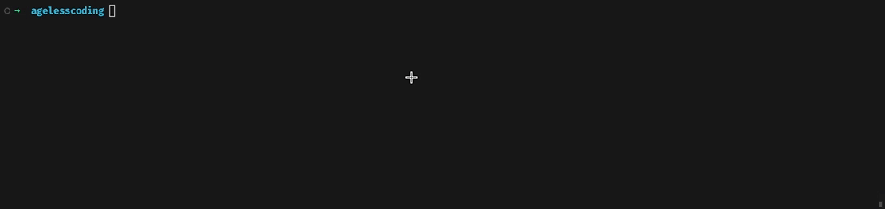

# `@agelesscoding/cli`



## Quick Start

First, you need to install the scaffolding globally:

```bash
$ npm install -g @agelesscoding/cli
```

Then, you can use the `agelesscoding` or `agc` command to create a project:

```bash
$ mkdir demo && cd demo
$ agc init # or agc init [projectName]
```

**Tip**: In the scaffolding's interactive interface, you can choose the built-in project template, or choose to develop a template yourself. Then, wait for the scaffolding to install the template to your project directory, and you can start development.

Happy coding ;-)
